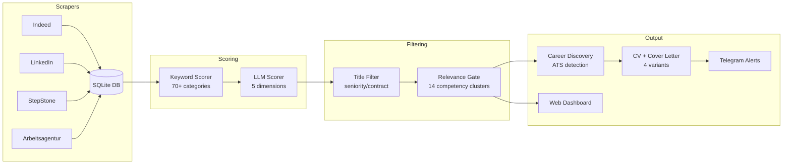

# job-search-pipeline

> Fully autonomous job search system. Runs 24/7, aggregates from 4 platforms, scores with rule-based + LLM pipeline, sends alerts. Under 15 EUR/month.


| 8,700+ jobs aggregated | ~300 new/day | 24/7 autonomous | <15 EUR/month |
|:-:|:-:|:-:|:-:|

---

## What It Does

This pipeline replaces manual job searching. Instead of checking Indeed, LinkedIn, StepStone, and Arbeitsagentur individually, it:

1. **Scrapes** 4 platforms automatically (cron-scheduled, proxy-rotated)
2. **Scores** every job with a two-stage system (keyword rules + LLM analysis)
3. **Filters** out irrelevant matches using regex-based title blocks + competency clusters
4. **Discovers** direct career page URLs and detects ATS systems (Workday, Greenhouse, etc.)
5. **Generates** tailored CVs and cover letters for top matches
6. **Sends** daily batches via Telegram for review

<!-- Screenshot placeholder -->
<!--  -->

## Architecture



## Features

| Feature | Description |
|---------|-------------|
| **Multi-Platform Scraping** | Indeed + LinkedIn (via [JobSpy](https://github.com/Bunsly/JobSpy) Docker), StepStone (Patchright browser), Arbeitsagentur (REST API) |
| **Two-Stage Scoring** | Stage 1: 70+ keyword categories with configurable weights. Stage 2: LLM-based 5-dimension analysis (day-to-day fit, growth, culture, skills, compensation) |
| **Intelligent Filtering** | Regex title blocks (seniority, contract type) + 14 competency cluster matching. Exception handling for flexible postings like "(Senior)" |
| **Career Page Discovery** | 3-layer strategy: DB cross-reference, StepStone redirect, website probing. Detects 18+ ATS systems |
| **CV/CL Generation** | HTML to PDF via headless Chromium. 4 CV variants (AI-heavy, technical, product, operations). Bilingual (EN/DE) |
| **Live Dashboard** | Browser-based UI with score filtering, source filtering, and one-click status updates |
| **Telegram Alerts** | Daily batch summaries + ZIP archives delivered to your phone |
| **Fully Configurable** | YAML config for queries, scoring weights, keywords. Candidate profile in Markdown |

## Quick Start

### Prerequisites

- Python 3.10+
- Docker (for JobSpy scraper)
- A VPS or always-on machine (4.50 EUR/month on Hetzner)

### 1. Clone & Configure

```bash
git clone https://github.com/yourusername/job-search-pipeline.git
cd job-search-pipeline

# Set up environment
cp .env.example .env
nano .env  # Fill in your API keys

# Customize search config
cp config/example.yaml config/settings.yaml
nano config/settings.yaml  # Add your search queries

# Create candidate profile
cp config/candidate_profile.example.md config/candidate_profile.md
nano config/candidate_profile.md  # Add your background
```

### 2. Install Dependencies

```bash
pip install -r requirements.txt
python -m patchright install chromium  # For browser scraping
```

### 3. Initialize Database

```bash
mkdir -p data
python -m src.scrapers.stepstone_scraper --queries "Data Analyst" --location Deutschland --db ./data/jobs.db
```

### 4. Run Your First Search

```bash
# Scrape StepStone
python -m src.scrapers.stepstone_scraper \
  --queries "AI Specialist" "Business Analyst" \
  --location Deutschland \
  --db ./data/jobs.db

# Score results
python -m src.scoring.score_jobs --db ./data/jobs.db --config config/settings.yaml

# Filter
python -m src.scoring.apply_filter --db ./data/jobs.db

# View in dashboard
python -m src.pipeline.dashboard --db ./data/jobs.db
# Open http://localhost:8080
```

### 5. Deploy (Optional)

For 24/7 autonomous operation, deploy to a VPS:

```bash
# On your VPS
sudo bash scripts/setup.sh
bash scripts/cron-setup.sh
```

See [docs/deployment.md](docs/deployment.md) for the full guide.

## Configuration

### Search Queries (`config/settings.yaml`)

The config file organizes queries into categories:

```yaml
queries:
  ai_roles:
    - "AI Trainer"
    - "Prompt Engineer"
    - "AI Operations"
  automation:
    - "Automation Specialist"
    - "RPA Analyst"
  # ... 15 categories, ~160 queries total
```

### Scoring Weights

Positive weights boost relevant jobs, negative weights penalize poor fits:

```yaml
scoring:
  weights:
    fully_remote: 180        # Highest boost
    ai_llm_operations: 65
    office_required: -400    # Strong penalty
    pure_sales: -400
```

See [docs/scoring.md](docs/scoring.md) for the full scoring explanation.

### Candidate Profile

Your background is stored in `config/candidate_profile.md` and used by the LLM scorer:

```markdown
# Candidate Profile
## Experience
- Data Analyst at TechCorp (2023-present)
## Skills
- Python, SQL, AI/LLM, Automation
## Preferences
- Remote, 50k+ salary
```

## Cost Breakdown

| Component | Monthly Cost | Purpose |
|-----------|:---:|---------|
| VPS (Hetzner CX22) | 4.50 EUR | Runs 24/7, cron jobs, dashboard |
| Claude API (Haiku) | 8-10 EUR | LLM scoring + cover letter generation |
| Proxy (iProyal) | 1-3 EUR | Indeed/LinkedIn rate limit bypass |
| **Total** | **< 15 EUR** | |

## Project Structure

```
job-search-pipeline/
├── src/
│   ├── scrapers/              # Platform-specific scrapers
│   │   ├── stepstone_scraper.py    # Browser automation (Patchright)
│   │   ├── arbeitsagentur_scraper.py  # REST API scraper
│   │   ├── import_jobspy.py        # JobSpy Docker → main DB
│   │   └── fetch_descriptions.py   # Description enrichment
│   ├── scoring/               # Two-stage scoring system
│   │   ├── score_jobs.py          # Keyword-based scorer
│   │   ├── llm_scorer.py         # LLM-based 5-dimension scorer
│   │   └── apply_filter.py       # Title blocks + competency filter
│   ├── discovery/             # Career page detection
│   │   └── career_discovery.py    # 3-layer URL discovery + ATS detection
│   ├── generation/            # Document generation
│   │   ├── cv_generator.py        # HTML→PDF CV (4 variants)
│   │   └── cover_letter_generator.py
│   └── pipeline/              # Orchestration + UI
│       ├── batch_pipeline.py      # Top N → CV+CL → ZIP → Telegram
│       └── dashboard.py          # Web UI for job review
├── config/
│   ├── example.yaml              # Search queries + scoring weights
│   ├── candidate_profile.example.md
│   └── scoring_weights.example.yaml
├── scripts/
│   ├── setup.sh                  # One-click VPS setup
│   ├── daily_pipeline.sh         # Daily cron orchestrator
│   ├── stepstone_pipeline.sh     # StepStone-specific pipeline
│   └── cron-setup.sh            # Install all cron jobs
├── docs/
│   ├── deployment.md             # VPS deployment guide
│   └── scoring.md               # Scoring system explained
├── Dockerfile
├── docker-compose.yml
├── requirements.txt
└── .env.example
```

## Tech Stack

- **Python 3.12** -- Core pipeline logic
- **SQLite** (WAL mode) -- Job storage, scoring, status tracking
- **Patchright** -- Anti-detection browser automation (Chromium)
- **JobSpy** -- Indeed + LinkedIn scraping via Docker
- **Claude API** (Haiku) -- LLM scoring and cover letter generation
- **Docker** -- Isolated scraper environment
- **Cron** -- Scheduling (5 jobs: search, score, batch, scrape, report)

## How It Compares to Job Alerts

| | Job Alerts | This Pipeline |
|---|---|---|
| Sources | 1 platform | 4 platforms |
| Scoring | None | Two-stage (rules + LLM) |
| Deduplication | None | Fuzzy matching across sources |
| Career Pages | None | Auto-discovered with ATS detection |
| Documents | None | Tailored CV + cover letter per job |
| Delivery | Email spam | Curated Telegram batches |
| Cost | Free | < 15 EUR/month |

## License

MIT -- see [LICENSE](LICENSE)

## Contributing

See [CONTRIBUTING.md](CONTRIBUTING.md)
